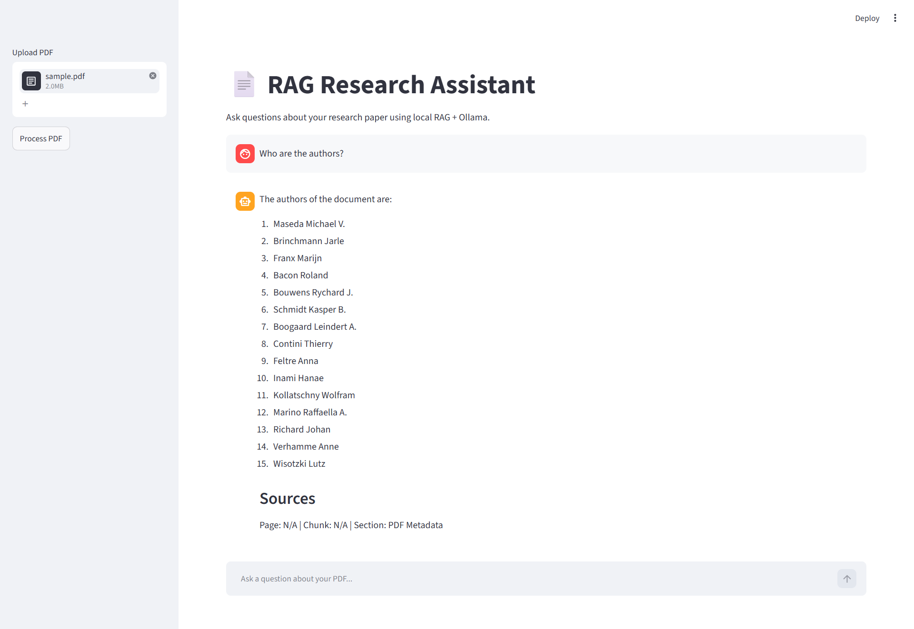

# RAG Research Assistant

A local Retrieval-Augmented Generation (RAG) application for interacting with research papers using PDF documents, vector search, and local Large Language Models (LLMs) powered by Ollama.

The system allows users to upload academic papers, build a vector database automatically, and ask natural language questions about the document while receiving answers grounded in the paper content.

---

## Demo



---

## Features

* Upload and process PDF research papers
* Automatic document chunking and indexing
* Vector database creation using ChromaDB
* Semantic search with sentence-transformer embeddings
* Local LLM inference using Ollama
* Question answering over research papers
* Source attribution for retrieved information
* Multi-PDF support
* Streamlit web interface
* Fully local pipeline (no OpenAI API required)

---

## Architecture

```text
PDF
 │
 ▼
Document Loader (PyPDF)
 │
 ▼
Text Chunking
 │
 ▼
Embeddings (BAAI/bge-base-en-v1.5)
 │
 ▼
Chroma Vector Database
 │
 ▼
Retriever
 │
 ▼
Ollama (Llama 3.2)
 │
 ▼
Answer + Sources
```

---

## Tech Stack

* Python
* Streamlit
* LangChain
* ChromaDB
* Ollama
* Llama 3.2
* Sentence Transformers
* PyPDF

---

## Installation

### 1. Clone the repository

```bash
git clone https://github.com/YOUR_USERNAME/rag-research-assistant.git
cd rag-research-assistant
```

### 2. Create a virtual environment

```bash
conda create -n rag-research-assistant python=3.11
conda activate rag-research-assistant
```

### 3. Install dependencies

```bash
pip install -r requirements.txt
```

---

## Install Ollama

Download and install Ollama:

https://ollama.com

Pull the Llama model:

```bash
ollama pull llama3.2:3b
```

Verify installation:

```bash
ollama run llama3.2:3b
```

---

## Run the Application

```bash
streamlit run app/streamlit_app.py
```

Open your browser and navigate to:

```text
http://localhost:8501
```

---

## Usage

1. Upload a PDF research paper.
2. Click **Process PDF**.
3. Wait for vector database creation.
4. Ask questions about the paper.
5. Review retrieved sources alongside generated answers.

Example questions:

```text
Who are the authors?

What is the main goal of this paper?

What methodology was used?

What are the key findings?

What datasets were used?
```

---

## Project Structure

```text
rag-research-assistant/
│
├── app/
│   ├── pdf_processor.py
│   ├── rag_qa.py
│   └── streamlit_app.py
│
├── data/
│
├── images/
│   └── demo.png
│
├── uploaded_files/
├── vectorstore/
│
├── .gitignore
├── requirements.txt
└── README.md
```

---

## Future Improvements

* Conversational memory
* Multi-document retrieval
* PDF page preview
* Citation highlighting
* Research paper summarization
* Advanced metadata extraction
* Hybrid retrieval methods
* Cross-paper comparison

---

## License

This project is intended for educational and research purposes.

---

## Author

Developed as a portfolio project focused on Retrieval-Augmented Generation (RAG), semantic search, and local LLM applications. EHSAN.R
